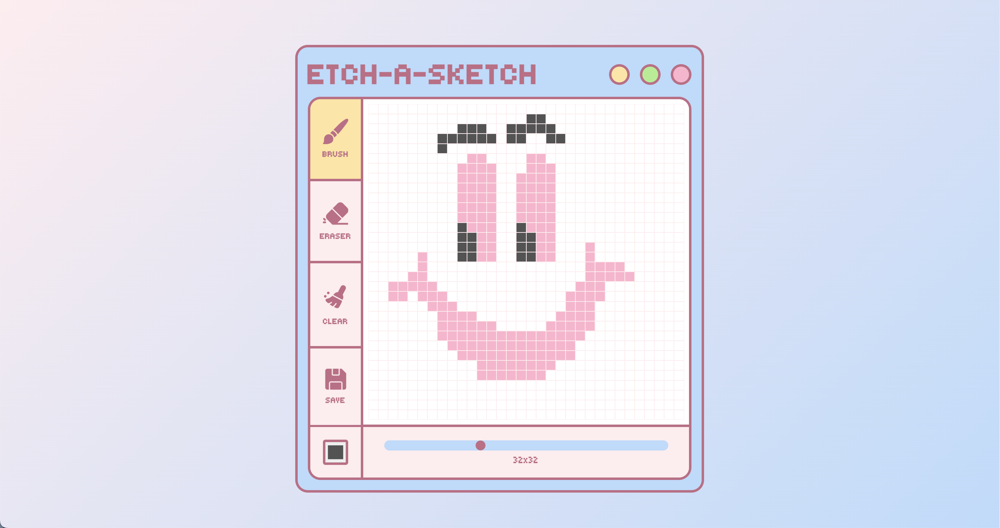

# Etch-a-Sketch

A browser-based **Etch-a-Sketch** app built with HTML, CSS, and JavaScript.

Originally developed as part of [The Odin Project Foundations](https://www.theodinproject.com/paths/foundations/courses/foundations) curriculum, this version is enhanced with extra tools, color selection, grid customization, and artwork saving.

## Features

Features

- 🖌️ Brush Tool – Draw on the grid with a selectable color.
- 🩹 Eraser Tool – Remove parts of the drawing.
- 🎨 Color Picker – Choose any brush color.
- 🔲 Resizable Grid – Change grid size (up to 100×100).
- ♻️ Clear Button – Reset the entire canvas.
- 💾 Save Artwork – Export your creation as a PNG file.

## Preview

## Live Demo
Try creating your own artwork [here](https://charmbun.github.io/etch-a-sketch/).

## License
This project is for educational purposes only.
All referenced names and image inspirations are used for non-commercial purposes.